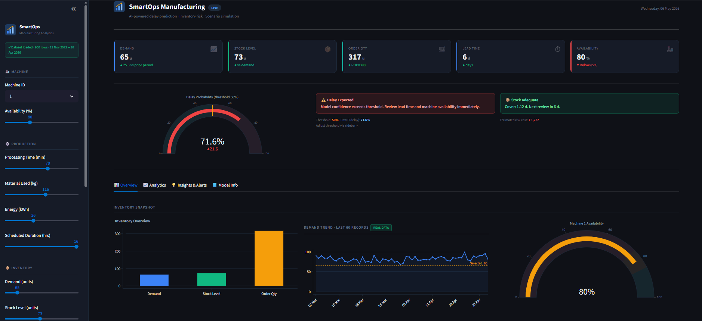
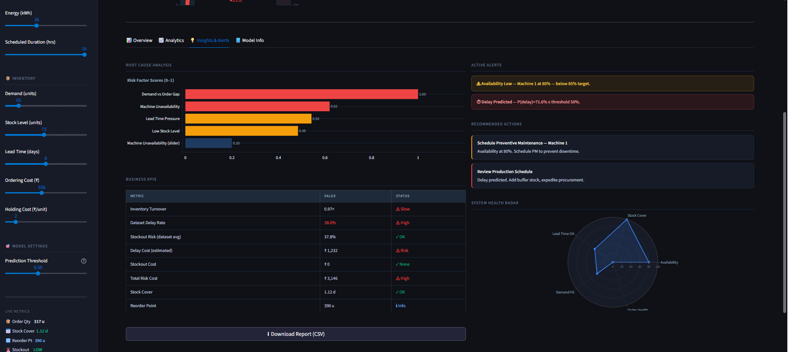
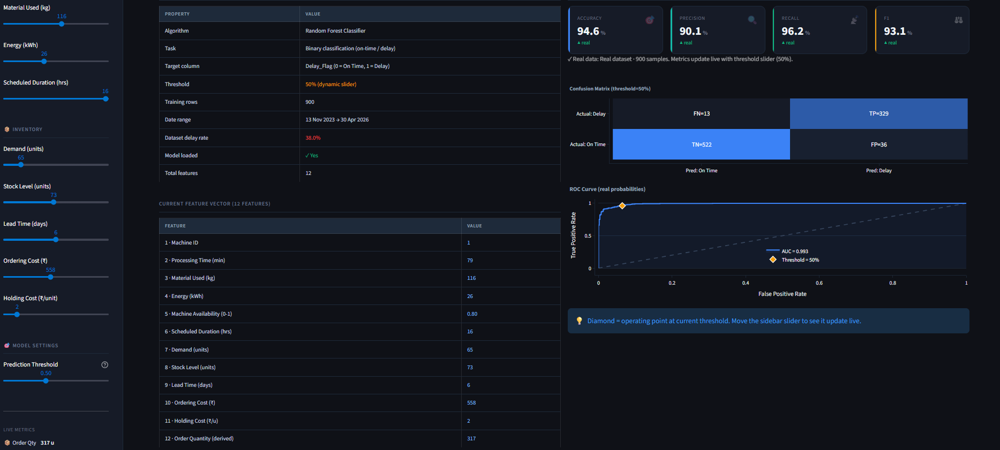

# 🏭 Smart Manufacturing Analytics

## 🔍 Problem Statement

Manufacturing industries often face unexpected delays that impact production efficiency, costs, and delivery timelines.

## 🎯 Objective

Build a machine learning model to predict production delays and identify key factors affecting manufacturing performance.

## 📊 Dataset

* Synthetic manufacturing dataset
* Features include:

  * Machine usage
  * Energy consumption
  * Demand
  * Production time
  * Delay flag (target variable)

## ⚙️ Approach

* Data preprocessing and cleaning
* Feature engineering
* Model building using Random Forest Classifier

## 📈 Results

* Achieved ~80% accuracy in predicting delays
* Identified major factors contributing to delays

## 📸 Output Preview

## 💡 Business Impact

* Helps reduce production delays
* Improves operational efficiency
* Supports data-driven decision making

## 🛠 Tools Used

* Python
* Pandas
* NumPy
* Scikit-learn
* Streamlit

## 🚀 Future Improvements

* Deploy model with better UI
* Use real-world dataset
* Improve model accuracy

